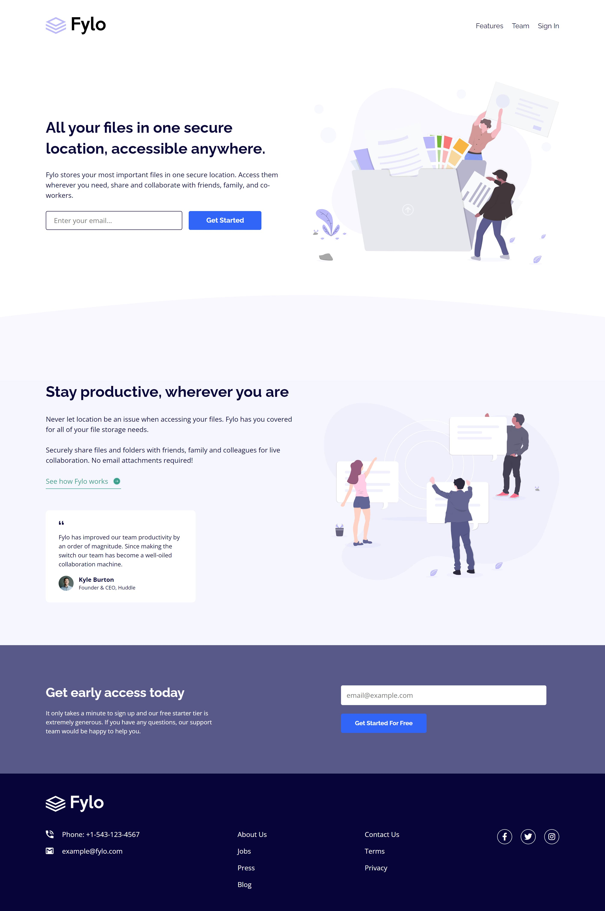

# Frontend Mentor - Fylo landing page with two column layout solution

This is a solution to the [Fylo landing page with two column layout challenge on Frontend Mentor](https://www.frontendmentor.io/challenges/fylo-landing-page-with-two-column-layout-5ca5ef041e82137ec91a50f5).

### Screenshot

### Links

- Live Site URL: [Click here](https://jamilpl.github.io/fylo-landing-page/)

### Built with

- HTML5
- CSS
- Flexbox
- Mobile-first

## Author

- Frontend Mentor - [@jamilpl](https://www.frontendmentor.io/profile/jamilpl)
